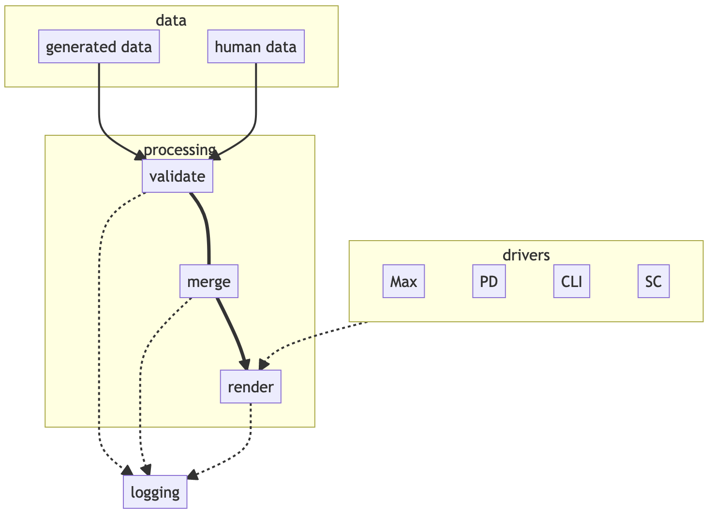

# flucoma-docs code proto-documentation

Some code proto-documentation, aimed at those who need to extend or help maintain `flucoma-docs`. The very high level sketch is that there's some C++ code that scrapes some data from the `Clients` in `flucoma-core`, and some Python code that unites this data with structured, handwritten documentation and renders the result into a choice of formats, targeting the environments Flucoma deploys to.

## The C++ Bit

We shall gloss over for now, because it has Change In its Future, pending some significant refactoring and reorganising work on `flucoma-core` in the coming months. It's unfortunately pretty hard to follow unless you know the details of the innards of core, and no-one but me fits that brief currently. In any case, yes I know it takes a while to build. No, I don't know when that will improve.


## The Python Bit

The Python portion has recently had quite an extensive reorganisation, to transform it from the well-known idiom of one-hooj-scary-function, and to pave the way for extending it to produce Supercollider docs. This means it's now a good deal more readable–and documentable–than before, albeit still slightly shonky almost everywhere you look.

Below is the basic flow:



The Python code all lives in the `flucoma` folder and its children (and so, is in various subpackages of `flucoma` in Python). The main entry point is `flucoma.MakeRef`, which is normally invoked via CMake (but can be invoked by hand, which will be done from the master `flucoma-docs` folder and will look something like this for SuperCollider: `python3 -m flucoma.MakeRef sc build/json doc build/sc-ref flucoma/doc/templates`, also see line 129 of `CMakeLists.txt`). It expects 
* a string telling it which CCE to render for
* a collection of paths telling it where to find data, and where to write output.

The `main` function parses the program arguments, dynamically loads a 'driver' for the required host (see below), and then goes through the steps of validating, merging and rendering for each file it encounters in the JSON folder.  

Nothing else currently lives in the top level package: all the action is down in `flucoma.doc`.

### Data (`flucoma.doc.data`)

* We have JSON files, containing the generated data for a `Client`. This is taken to be the canonical Source of Truth for the names, number, types, etc. of parameters / controls, messages and so forth exposed by the object (because it comes from the code that defines the object).

* We also have YAML files, that have actual human crafted words that explain these various data. They are only YAML for now – we've decided to port them to reStructuredText once this update is settled. But YAML they are, which makes them easy for computers, but fiddly for humans.

* Blocks of prose *within* the YAML, however, still might want some inline markup, for emphasis, lists, links to other objects etc. *That's* in reStructuredText, just to add to the fiddly for humans bit (hence the forthcoming change).

* Nonetheless, basic takeaway: two sources of data, and they may or may not match. If they *don't* match, it would be good to tell a human person, so that the handwritten documentation can be brought back into sync with all that is good and true.

### Validation (`flucoma.doc.validate`)

This is where the most complex work happens. Given our canonical generated data for each object, we want to check that the handwritten documentation covers everything, and warn the world if there's stuff missing. However, there are instances where parameters or messages that are common across a bunch of objects might have some common documentation to be used, to cut down on redundancy and chances for inconsistency. There are also occasional slight differences between different environments and how stuff needs to be documented. So, things can get a bit edge-casey.

Validation proceeds hierarchically. First through the object, checking for the top-level stuff like a digest and description for each Client, and then through controls (parameters) and messages (and message arguments).

The original incarnation of this code was a forest of `if` trees and manual `dict` mining. It wasn't nice, and was almost impossible to extend, so now we (ab)use the [schema](https://github.com/keleshev/schema) package to try for something a little clearer and more configurable. To be frank, it's still littered with code crimes, but hopefully more legible ones (and definitely more elegant). `Schema` basically works by being fed a data structure the same-ish shape as the thing you want to validate, and checking input against that. Because we're deriving Our Truth from the JSON, we build these structures on the fly.

`Schema` also allows for neat stuff, like denoting certain things as optional, or giving different options for how a value can be valid. However, its basic inclination when something is missing is to bail, whereas the strategy here is *always* to complete, but to provide meaningful and annoying feedback when stuff is missing. In any case where something is missing, we will fallback to checking to see if there is a 'default' for it. There are two sources of these defaults: one global (`flucoma.docs.defaults`), and one host-specific (provided by the 'driver': each host sub-package has a `defaults.py`). Host-specific entries will always override global ones. If a lookup fails, then a warning is issued to the logging system *and* rendered into the generated documentation. Y'know, for motivation.

The code to do all this is a bit gnarly, and a future version of these docs will go into much more detail about how its achieved, but the potted version:
1. doing this fallback trick with `Schema` at the same time as ascertaining what was there and what was missing seemed too horrible, so the validation for controls ('parameters' in soon-to-be-obsolete-speak) and messages happens in two passes, and missing data is filled out with `None`.
2. the `Fallback` stuff itself lives in `flucoma.doc.validate.common`, and takes some mild liberties in order to try and do lookups through hierarchically structured data.
3. our desire to actually tell the world useful things about what is missing results in the greatest number of code crimes and gratuitous cuteness. We're using the built-in `logging` package, and would like to be able to issue warnings that record which object, control, message argument or whatever is missing documentation. To do this, we have a 'context' variable, which is updated using Python a `contextmanager` (basically a thing you can use in a `with` block). To be able to actually keep that up to date whilst `Schema` does its stuff has involved making a little `Schema` wrapper (`RecordContext`) in `common` that records the context as it iterates over structures. At the cost of readability.

### Merging

Once we've finished checking and fleshing out our documentation, the generated and handwritten data are merged to a single `dict`y structure to be passed on to rendering. At this stage, controls that are non-modulate-able are separated off, because each host treats them differently to modulate-able ones.

However, because the needs of different environments are, well, different, there is a post-processing stage following the merge. The most glaring difference here is that whilst for Max and PD we need our controls and messages to be sorted, in SC they need to remain in the order declared.

### Rendering

Still happens via `Jinja`. The templates for Max, PD and CLI are substantively unchanged. There are new templates for SC, which use Jinja's inheritance feature so that the very different shapes of different species of object can be parcelled off cleanly.

As with the validation, I've had to do some cute things in order to try and keep track of 'context' whilst the render is going on, in order to log any warnings from docutils when it renders reStructuredText. The gist of this is that a view type is wrapped around the dictionaries for controls and messages that records the current context when they are iterated by Jinja (see `flucoma.doc.logger.ContextView`).

A note on rendering links to other Flucoma objects. The most frequent cause of reStructuredText errors seems to be with trying to pluralise a `:fluid-obj:` reference like

```reStructuredText
.. won't work:
:fluid-object:`DataSet`s  
```
I don't have a completely good solution to this yet. reStructuredText reference syntax would let us have different text, whilst still linking to the correct entity:

```reStructuredText
:fluid-obj:`DataSets<DataSet>`
```

would print `DataSets` but still link properly in SC (i.e. to `Classes/FluidDataSet`), PD and CLI, but I don't think there's a way in Max to link to another object and have alternate link text: what we need to have rendered is `<o>fluid.dataset~</o>`.

### Logging

Ah, I've already gone on about this a bit. Some effort was made to try and improve the quality of information given back. Notably:
1. running make ref will produce a `flucoma-makeref.log` file, with any warnings. These will still be written to `stderr` as well, unless the script is run with `--quiet`
2. A problem before was that the docutils warnings weren't very helpful (partly because we process in fragments, so the line numbers were meaningless). I now try and record both the broad context, and retrieve the actual troublesome markup.
3. It's all a bit Heath-Robinson, in that I've had to wrap the logging framework in and around all these other packages. But, for all that it's not so obvious how it all works, it's not very intrusive: it can be altered, or turned off entirely very easily.

### Drivers

Contain all that is needed to account for the differences between our different rendering targets. It's all still a bit heterogenous and scrappy. Perhaps making the data structures more categorically clear with some hierarchy, and being more Pythonic about using `kwargs` would make it all seem less ad hoc.  

## TODOs

* Test coverage is pretty woeful, partly because I'm getting near to the stuff that's hard to test, like rendering.
* There should be some authoring docs that detail the few bits of reStructuredText magic we use (and give a more comprehensive cookbook once we've transitioned to reST properly)
* These code docs could obviously be much more extensive. One possibility would be to use Sphinx to manage these and host on the github pages for this repo (which might be an interesting test case ahead of documenting core)
* The C++ remains mysterious to all but I
* Rendering control constraints is still a horror show, but less than it was
* All the code could be made more readable still
